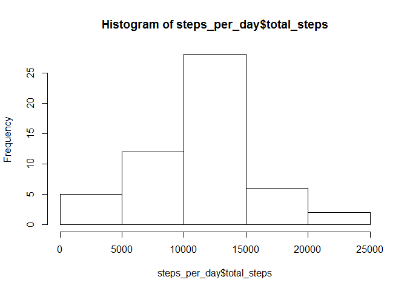
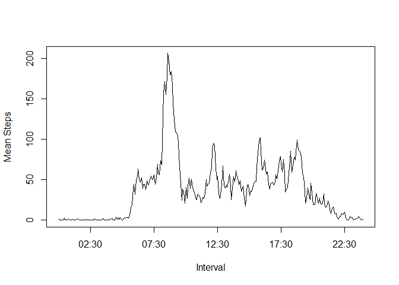
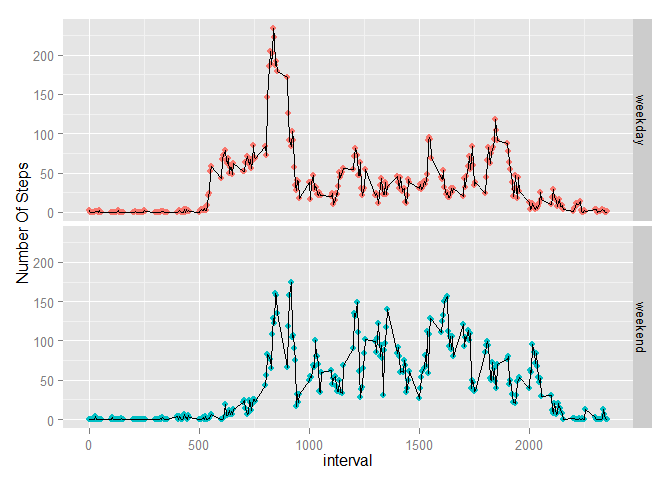

# Reproducible Research: Peer Assessment 1

Load Libraries  

```r
  library(R.utils)
```

```
## Loading required package: R.oo
## Loading required package: R.methodsS3
## R.methodsS3 v1.6.1 (2014-01-04) successfully loaded. See ?R.methodsS3 for help.
## R.oo v1.18.0 (2014-02-22) successfully loaded. See ?R.oo for help.
## 
## Attaching package: 'R.oo'
## 
## The following objects are masked from 'package:methods':
## 
##     getClasses, getMethods
## 
## The following objects are masked from 'package:base':
## 
##     attach, detach, gc, load, save
## 
## R.utils v1.34.0 (2014-10-07) successfully loaded. See ?R.utils for help.
## 
## Attaching package: 'R.utils'
## 
## The following object is masked from 'package:utils':
## 
##     timestamp
## 
## The following objects are masked from 'package:base':
## 
##     cat, commandArgs, getOption, inherits, isOpen, parse, warnings
```

```r
  library(dplyr)
```

```
## 
## Attaching package: 'dplyr'
## 
## The following object is masked from 'package:stats':
## 
##     filter
## 
## The following objects are masked from 'package:base':
## 
##     intersect, setdiff, setequal, union
```

```r
  library(chron)
  library(ggplot2)
```


<hr>
## Loading and preprocessing the data

<hr>
Uncompressing Data 

```r
  if ( ! file.exists("activity.csv")){
    unzip("activity.zip")
  } 
```

Loading data from CSV. 

```r
csvdatafull <- read.csv("activity.csv") %>% tbl_df()

csvdata <- csvdatafull %>%
  filter(!is.na(steps))
```

We have loaded 2 data sets. `csvdatafull` and `csvdata`

There are total 17568 records. `csvdata` is a subset of `csvdatafull` having 15264 records. All records with no data for steps available are filtered out.

<hr>

## What is mean total number of steps taken per day?

* Calculate the total number of steps taken per day


```r
steps_per_day <- csvdata %>%
  group_by(date) %>%
  summarize(total_steps = sum(steps)) 
head(select(steps_per_day,date,total_steps))
```

```
## Source: local data frame [6 x 2]
## 
##         date total_steps
## 1 2012-10-02         126
## 2 2012-10-03       11352
## 3 2012-10-04       12116
## 4 2012-10-05       13294
## 5 2012-10-06       15420
## 6 2012-10-07       11015
```

* Make a histogram of the total number of steps taken each day


```r
hist(steps_per_day$total_steps)
```

 

* Calculate and report the mean and median of the total number of steps taken per day


```r
mean_steps <- round(mean(steps_per_day$total_steps),0)
median_steps <- median(steps_per_day$total_steps)
```
* Mean Total Steps - (10766)
* Median Total Steps -  (10765)


## What is the average daily activity pattern?

* Make a time series plot (i.e. type = "l") of the 5-minute interval (x-axis) and the average number of steps taken, averaged across all days (y-axis)


```r
csvdata_by_interval <- csvdata %>%
  mutate(strtime = sprintf("%04d",interval)) %>%
  mutate(strtime = as.POSIXct(strtime, format="%H%M"))  %>%
  group_by(strtime) %>%
  summarize(mean_steps = mean(steps))


with(csvdata_by_interval,plot(strtime, mean_steps,
                               main = "",
                               xlab = "Interval", 
                               ylab="Mean Steps", 
                               type="l"))
```

 

* Which 5-minute interval, on average across all the days in the dataset, contains the maximum number of steps?


```r
max_steps <- max(csvdata_by_interval$mean_steps)
maximum_activity_period <- csvdata_by_interval %>% 
  filter( mean_steps == max_steps) %>% 
    select(strtime)
```

Maximum steps are recorded in period 08:35
<hr>

## Imputing missing values

Note that there are a number of days/intervals where there are missing values (coded as NA). The presence of missing days may introduce bias into some calculations or summaries of the data.

* Calculate and report the total number of missing values in the dataset (i.e. the total number of rows with NAs)


```r
  missing_values <- nrow(csvdatafull) - nrow(csvdata)
```

Total number of missing values in the the dataset are = 2304 

* Devise a strategy for filling in all of the missing values in the dataset. The strategy does not need to be sophisticated. For example, you could use the mean/median for that day, or the mean for that 5-minute interval, etc.

We will use the median of the 5 minute intervals across all days to populate the missing values. 

* Create a new dataset that is equal to the original dataset but with the missing data filled in.

Lets create a data set `median_by_interval` holding medians of steps across all days in same interval


```r
median_by_interval <- csvdata %>%
  group_by(interval) %>%
  summarize(median_steps = median(steps))
```

Now we will extract a data set `no_steps_data` from complete data set where steps are not available


```r
no_steps_data <- csvdatafull %>%
  filter(is.na(steps))
```

We will now merge `no_steps_data` with `median_by_interval` using `interval` as key. 


```r
updated_steps_data <- inner_join(no_steps_data,median_by_interval,by = "interval") %>%
  mutate(steps = median_steps) %>%
  select (steps, date, interval)
```


We will now join `updated_steps_data` and `csvdata` to create a new data set `full_data_updated_steps`. This data set is of same size as of original data set `csvdatafull`


```r
full_data_updated_steps <- rbind(updated_steps_data,csvdata)
```

The data set we created now `full_data_updated_steps` has 17568 records. This is same as we have in our original data set `csvdatafull` (17568)

* Make a histogram of the total number of steps taken each day and Calculate and report the mean and median total number of steps taken per day. Do these values differ from the estimates from the first part of the assignment? What is the impact of imputing missing data on the estimates of the total daily number of steps?


```r
updated_steps_per_day <- full_data_updated_steps %>%
  group_by(date) %>%
  summarize(total_steps = sum(steps)) 

hist(steps_per_day$total_steps)
```

 

```r
mean_steps_updated <- round(mean(updated_steps_per_day$total_steps),0)
median_steps_updated <- median(updated_steps_per_day$total_steps)
```

* Mean Total Steps - Earlier (10766) - Now (9504)
* Median Total Steps - Earlier (10765) - Now (10395)

Imputing missing data has clearly influenced our Mean and Median. Apparently not the best strategy to use medians for populatinng missing data.


## Are there differences in activity patterns between weekdays and weekends?

As the imputed data `full_data_updated_steps` has skewed our Medians and Means. We will use the filtered data `csvdata` for this analysis.

* Create a new factor variable in the dataset with two levels - "weekday" and "weekend" indicating whether a given date is a weekday or weekend day.


As a first step we will add another field `daytype` to indicate if the observation is for weekend or for weekday.


```r
# Convert date from string to date 
steps_with_weekend_flag <- csvdata %>%
  mutate(date = as.Date(date, format="%Y-%m-%d")) %>%
  mutate(daytype = as.factor(ifelse(is.weekend(date), "weekend", "weekday" )  )) %>%
  group_by(daytype,interval) %>%
  summarize(mean_steps = mean(steps))
```

You can see a new field daytype having levels : weekday, weekend


```r
g <- ggplot(steps_with_weekend_flag, aes(interval,mean_steps ))
p <- g + geom_point(aes(color=daytype)) + geom_line() +
  guides(colour=FALSE) +
  guides(size=FALSE) +
  facet_grid( daytype ~ .) +
  labs(y = "Number Of Steps")
print(p)
```

 

Examing these charts we can see that this person walks more on the weekends as compared to weekdays.


